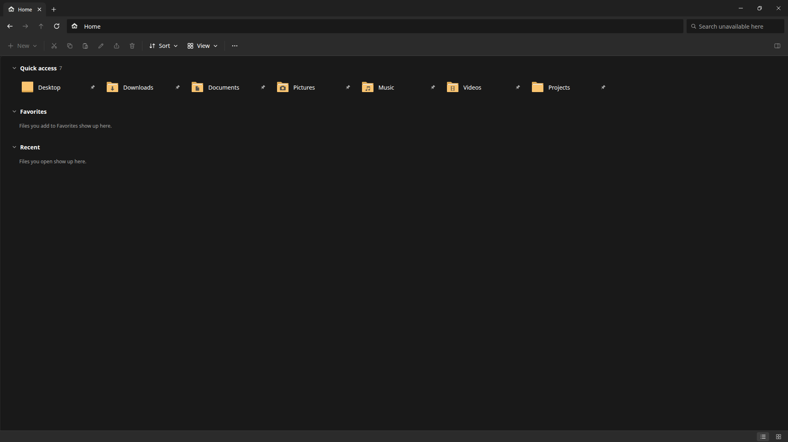
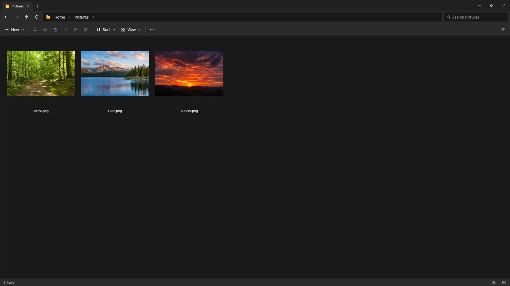
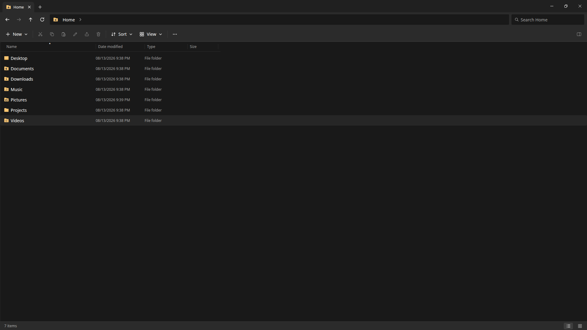
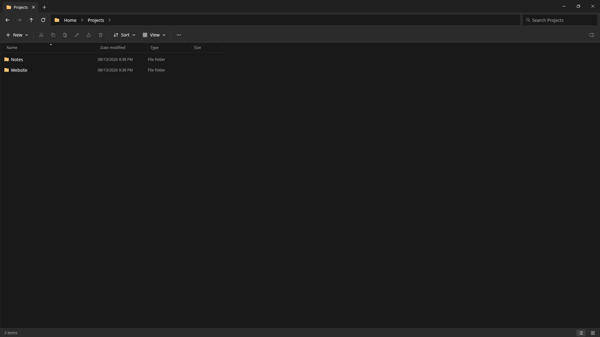
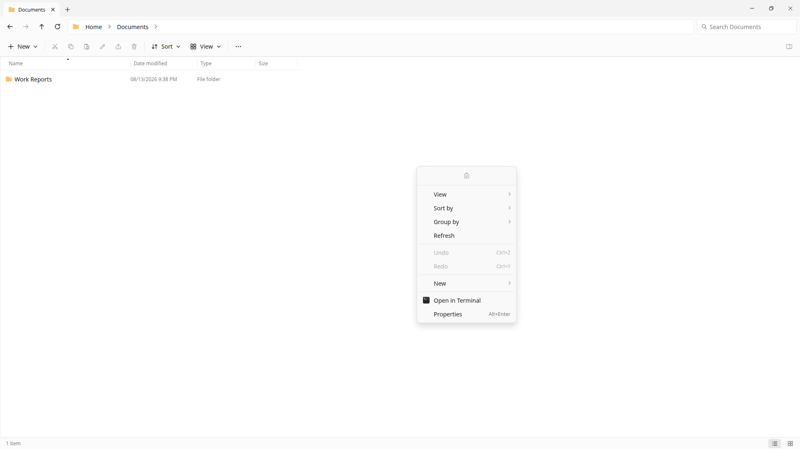

# LiqExplorer

Windows 11–style File Explorer for Linux.

Tabs, command bar, breadcrumb address bar, navigation tree, details/icon views with sort & group, Explorer-style context menus, file ops with progress/conflict/undo, and desktop-compatible trash, clipboard, and thumbnails (via GIO/gvfs).

> **Status: early development (v0.1).** Core shell is usable for trying out, but this is not a daily driver yet. Best on **X11** (Cinnamon/GNOME/XFCE/MATE). Wayland works for browsing with limited clipboard interop.


## Screenshots

Captured from a disposable demo profile (generic folders and stock-style photos only — no personal files or drives).












## Requirements

- Linux x86_64
- Node.js 20+ (for building from source)
- **Required for full features:** `gio` (glib/gvfs), `python3` + GTK3 PyGObject, `ripgrep` (`rg`), `7z` (p7zip / 7-Zip)
- Optional: `unrar` / `unar` (better RAR support), `udisksctl` (eject/power-off)

### Distro packages

**Arch / Manjaro**
```bash
sudo pacman -S nodejs npm gvfs gtk3 python-gobject ripgrep p7zip
# optional: unrar unarchiver udisks2
```

**Fedora**
```bash
sudo dnf install nodejs npm gvfs gtk3 python3-gobject ripgrep p7zip p7zip-plugins
# optional: unrar unar udisks2
```

**Debian / Ubuntu / Mint**
```bash
sudo apt install nodejs npm gvfs libgtk-3-0 python3-gi python3-gi-cairo \
  gir1.2-gtk-3.0 ripgrep p7zip-full
# optional: unrar unar udisks2
```

Missing tools soft-fail (status bar warning + console log) instead of crashing — e.g. no `rg` disables content search only.

## Try it (build from source)

```bash
git clone https://github.com/L1QUIFIER/liqexplorer.git
cd liqexplorer
npm install
npm run build
npm start
```

Install a menu entry / desktop icon (does **not** change your default file manager):

```bash
bash bin/install-app.sh
```

Opt in as the default folder handler (reversible — restores your previous handler):

```bash
bash bin/install-default.sh
# undo:
bash bin/install-default.sh --undo
```

## AppImage (optional packaging)

```bash
npm install
npm run build
npm run dist:appimage
```

Output lands in `release/`. Requires `electron-builder` (pulled as a devDependency) and typical Linux packaging tools (`fuse` / AppImage runtime on the build host).

## Develop

```bash
npm install
npm run build
npm start
```

Scratch profile (does not touch your normal settings):

```bash
LIQEXPLORER_TEST=1 npm start
```

If the project lives on a CIFS/SMB share where binaries are not executable, use the CIFS-safe install and staging scripts documented in `CLAUDE.md`:

```bash
npm install --no-bin-links --ignore-scripts
bash bin/build.sh
bash bin/run.sh
```

## Layout

| Path | What it is |
|---|---|
| `src/main/` | Electron main: windows, IPC, filesystem, file-ops engine, platform integration |
| `src/renderer/` | Vanilla TypeScript UI: chrome, views, nav pane, menus, dialogs |
| `src/shared/` | Shared IPC contracts and types |
| `helpers/` | Out-of-process helpers (X11 clipboard owner) |
| `docs/PARITY.md` | Win11 parity backlog and status |

## Portability notes

- **Terminal:** `xdg-terminal-exec` → `$TERMINAL` → Cinnamon/GNOME settings → common terminals → `xterm`
- **Theme:** XApp portal → GNOME `color-scheme` → Electron `nativeTheme`
- **Clipboard:** full interop needs X11 + python3-gi; otherwise in-app paste still works
- **Default handler undo:** restores the previous `xdg-mime` handler (Nemo/Nautilus/Dolphin/…)

## Roadmap

See [`docs/PARITY.md`](docs/PARITY.md) for the feature backlog. Broader Wayland clipboard/DnD and polished store packages come next.

## License

License not chosen yet — treat as source-available for now. Do not redistribute as your own product.
